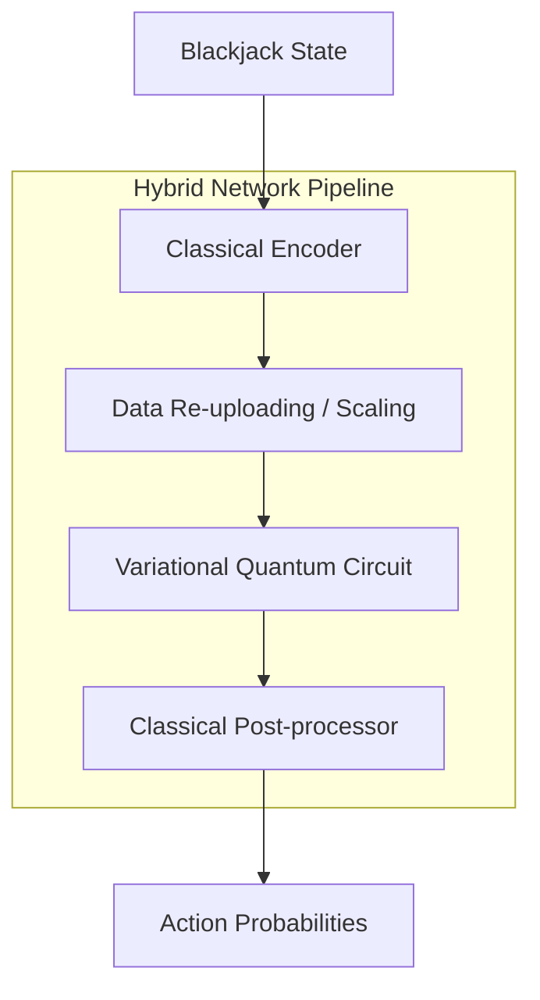

# Blackjack Hybrid Quantum-Classical Exploration

An exploration of Variational Quantum Circuits (VQC) in Reinforcement Learning (RL), specifically comparing hybrid quantum-classical agents against traditional classical models in the game of Blackjack.

## Overview

This project was developed to investigate whether incorporating a quantum circuit into a neural network could provide a behavioral or performance advantage in a discrete state-space game. While the findings suggest that the classical state of Blackjack may not fully leverage quantum complexity, the project provides a framework for hybrid RL research.

### Key Objectives
*   **VQC Integration**: Implementing a hybrid pipeline using PyTorch and PennyLane.
*   **A2C Framework**: Utilizing Advantage Actor-Critic with Generalized Advantage Estimation (GAE).
*   **Behavioral Analysis**: Investigating decision entropy, strategy agreement, and quantum circuit contribution (linearity checks).

## Architecture



## Core Findings

*   **Exploration over Advantage**: The project successfully demonstrated a functional hybrid pipeline, though the discrete nature of Blackjack states (3 normalized inputs) often resulted in the quantum circuit acting as a linear transformer rather than a non-linear advantage source.
*   **Uncertainty Tax**: Hybrid models frequently exhibited higher decision entropy compared to classical counterparts, indicating an "uncertainty tax" when mapping low-dimensional classical data through high-dimensional Hilbert spaces.
*   **Encoder Dependency**: Experiments with "Microwaved Encoders" (freezing pre-processing layers) highlighted the challenge of forcing the quantum circuit to lead the learning process.

## Project Structure

*   `blackjack_experiment/core`: Implementation of the A2C agent and trainer.
*   `blackjack_experiment/networks`: Hybrid and Classical network architectures.
*   `blackjack_experiment/analysis`: Tools for strategy heatmaps and quantum contribution metrics.
*   `main.py`: Unified CLI for training, simulation, and evaluation.
*   `jimbo_the_gambling_bot.py`: A self-contained demonstration of the hybrid agent.

## Getting Started

### Local Installation

1.  Clone the repository:
    ```bash
    git clone https://github.com/your-repo/blackjack_experiment.git
    cd blackjack_experiment
    ```
2.  Install in editable mode:
    ```bash
    pip install -e .
    ```

### Usage

**Train a Hybrid Model:**
```bash
python main.py train --type hybrid -e 5000
```

**Compare Classical vs Hybrid:**
```bash
python main.py compare -e 5000
```

**Run Interactive Simulator:**
```bash
python main.py simulate path/to/checkpoint.pth
```

### Docker Deployment

Build and run using Docker:
```bash
docker build -t blackjack-rl .
docker run -it blackjack-rl compare --episodes 1000
```

## Acknowledgments
Developed as an academic exploration of Quantum Machine Learning and Reinforcement Learning limitations and possibilities.
