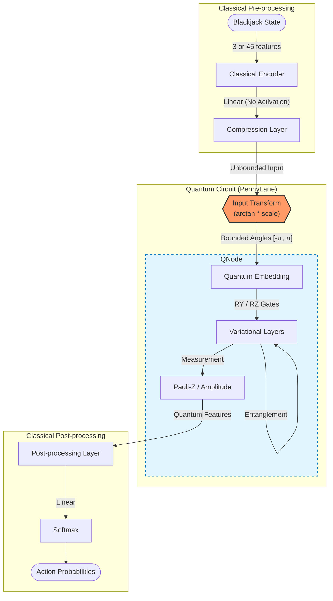
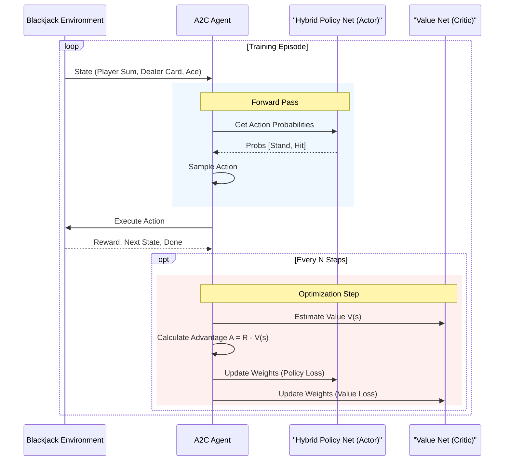

# System Architecture

### Hybrid Network Architecture

This diagram illustrates the data flow inside `UniversalBlackjackHybridPolicyNetwork`, highlighting the input transformation and the quantum-classical interface.

## System Overview (A2C Training Loop)

This diagram shows how the `A2CAgent` interacts with the environment and how the hybrid network fits into the broader reinforcement learning context.

